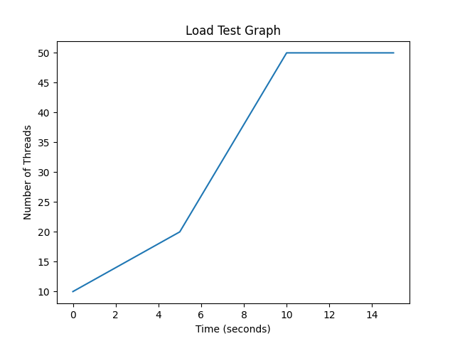
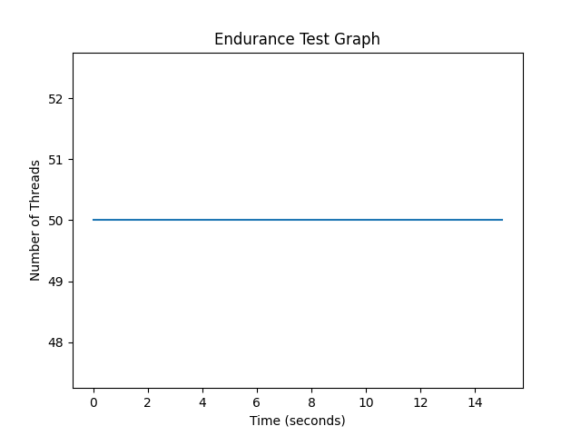
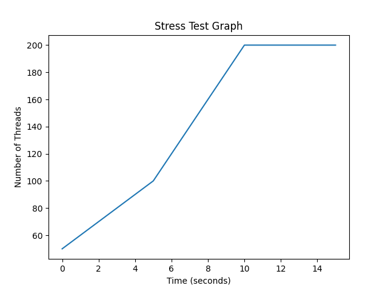

# Project 3: Performance Testing using JMeter

## Introduction

Performance testing is an important part of software development that evaluates how an application behaves under different levels of load. It helps identify bottlenecks, improve response time, and ensure system reliability.

In this project, I used Apache JMeter to perform performance testing on my own application developed in Project 2. The application includes an API endpoint `/words`, which was used to simulate user requests and analyze system performance.

---

## Part 1: Types of Performance Testing

### 1.1 Load Testing

**Definition:**  
Load testing checks how the system performs under expected user load. It ensures the application can handle a specific number of users without degradation.

**Goal:**
- Validate response time
- Identify bottlenecks under normal conditions
- Ensure system stability

In this test, a moderate number of users send requests to the `/words` endpoint.

#### Graph:

**Explanation:**  
The number of threads increases gradually over time until it reaches a steady level

---

### 1.2 Endurance Testing (Soak Testing)

**Definition:**  
Endurance testing evaluates system performance over an extended period under a constant load.

**Goal:**
- Detect memory leaks
- Identify performance degradation over time
- Ensure long-term stability.

In this test, users continuously send requests to the `/words` endpoint for a longer duration.

#### Graph:

**Explanation:**  
Threads are ramped up and then held constant for a long duration to observe stability.
---

### 1.3 Stress / Spike Testing

**Definition:**  
Stress testing pushes the system beyond its limits, while spike testing introduces sudden increases in load.

**Goal:**
- Determine system breaking point
- Observe recovery behavior
- Identify failure handling

#### Graph:

**Explanation:**  
Threads rapidly increase (spike) and then drop, simulating sudden traffic bursts.
---

## Part 1: JMeter Components

### Thread Group

The Thread Group defines the number of users (threads), ramp-up time, and loop count. It controls how many users access the application and how quickly they are introduced.

#### Screenshot:

---

### HTTP Request Sampler

The HTTP Request Sampler is used to send requests to the server. In this project, it was configured to send GET requests to the `/words` endpoint.

#### Screenshot:

---

### Config Elements (HTTP Header Manager)

Config Elements allow customization of requests. The HTTP Header Manager is used to add headers such as `Content-Type: application/json`.

#### Screenshot:

---

### Listeners

Listeners display the results of the test, including response time, success rate, and throughput. The "View Results Tree" and "Summary Report" listeners were used.

#### Screenshot:

---

## Application Performance Index (Apdex)

The Application Performance Index (Apdex) is a standard metric used to measure user satisfaction based on response time.

- Satisfied: Fast response time  
- Tolerating: Acceptable delay  
- Frustrated: Slow response  

Apdex helps quantify how well the application meets user expectations.

---

## Part 2: JMeter Testing

### Test 1: Endurance Test

For this test, I created a Thread Group configured to simulate continuous user activity.

- Endpoint tested: `/words`
- Threads: 50
- Ramp-up: 10 seconds
- Loop count: 50

#### Screenshots:

---

### Test 2: Stress Test

In this test, the system was subjected to a high number of users to evaluate performance under extreme conditions.

- Endpoint tested: `/words`
- Threads: 200
- Ramp-up: 5 seconds

#### Screenshots:

---

## Results and Observations

During testing, the application performed well under moderate load. However, under stress conditions, response time increased, and some requests showed delays. This indicates that the system can handle normal traffic efficiently but may require optimization for high traffic scenarios.

---

## Conclusion

This project provided hands-on experience with performance testing using JMeter. I learned how to simulate multiple users, analyze system performance, and identify potential bottlenecks.

Using my own API endpoint `/words` made the testing more practical and relevant. In the future, performance can be improved by optimizing backend processing and implementing caching mechanisms.

---

## Recommendations

- Use cloud deployment for realistic testing
- Monitor CPU and memory usage during tests
- Optimize database queries for better performance